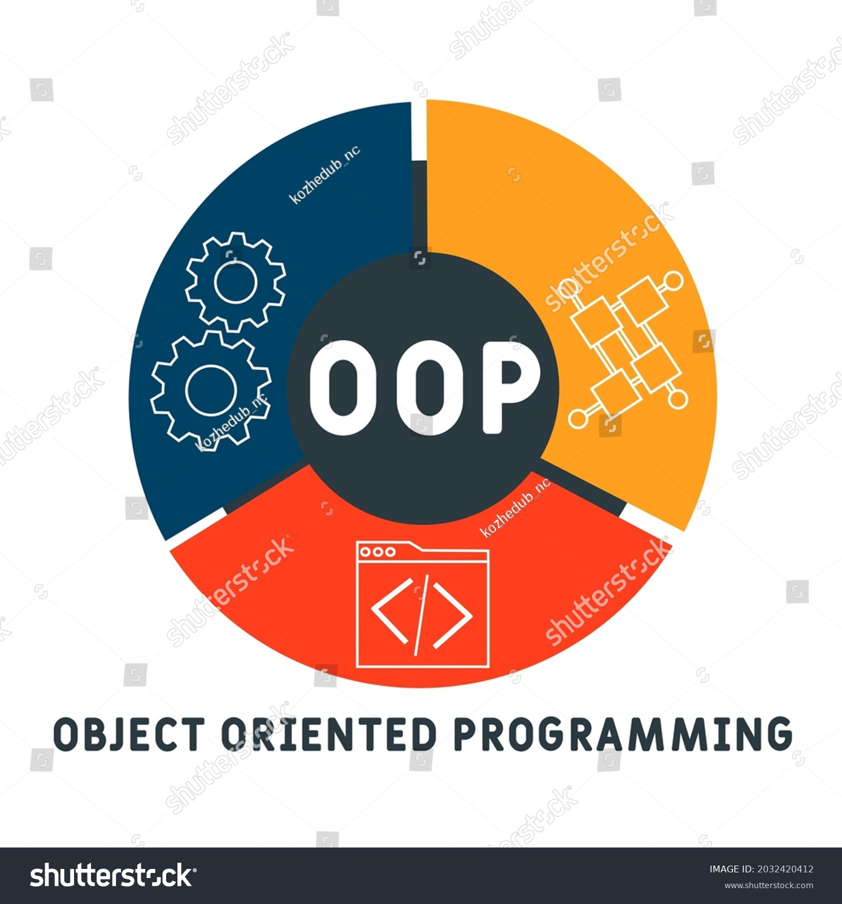

<p align="center">
    
</p>

<br/>

# Object-Oriented Programming

Welcome to the Object-Oriented Programming (OOP) repository! This repository serves as a comprehensive resource for students and educators, providing essential materials to enhance your understanding of OOP concepts.

## Contents

This repository includes:

- **Lab Assignments**: 
  - Practical exercises designed to reinforce the principles of object-oriented programming. Each lab focuses on key concepts such as classes, objects, inheritance, polymorphism, and encapsulation.
  - Code examples and detailed instructions to help you apply what you've learned in class.

- **Lecture Slides**: 
  - Downloadable presentations that cover essential topics and concepts in OOP.
  - Visual aids and examples to facilitate your understanding and retention of the material.

- **Projects**: 
  - A collection of project ideas and completed projects that demonstrate the application of OOP principles in real-world scenarios.
  - Each project includes a description, objectives, and guidance on how to implement it.

## Features

- **Organized Structure**: 
  - Materials are categorized by week and topic, making it easy to find what you need for your studies.
  - Clear folder names and documentation to guide your learning process.

- **Public Access**: 
  - All resources are freely available to support learning for anyone interested in object-oriented programming.
  - Encouragement for collaboration and sharing of knowledge within the community.

## Getting Started

To make the most out of the resources provided:

1. **Explore the Labs**: Work through each lab assignment to practice and solidify your understanding of OOP principles.
2. **Review the Slides**: Use the lecture slides as a study aid before exams or as a reference during your programming projects.
3. **Engage with the Projects**: Check out the project ideas and completed projects to see how OOP concepts are applied in practice. Feel free to contribute your own projects or enhancements.
4. **Engage with the Community**: Feel free to contribute improvements, share insights, or ask questions related to the course materials.

<br/>
<br/>

## License

© [2024] [Nguyen Thanh Dang]. All rights reserved.

This repository and its contents, including but not limited to lab assignments, lecture slides, and any associated materials, are for educational purposes only. 

**No part of this repository may be copied, reproduced, or distributed without explicit permission from the copyright holder.**

For inquiries, please contact [```dangnguyen.uit@gmail.com```].